# Part B - Architecture

Placeholders only: `192.168.X.0/24` (home LAN), `example.com` (your domain), `<tailnet>.ts.net`, `100.x.y.z` (a Tailscale address).
Evidence labels are defined in [`00-executive-summary.md`](00-executive-summary.md).

## 1. Layers

| Layer | Stage 1 choice | Notes |
|-------|----------------|-------|
| Physical | One machine, SSD + data disk + backup disk, UPS later | Hardware-agnostic; see Part D |
| Host OS | Debian 13 "trixie", headless, bare metal | Docker documents Debian 13 as supported **[V]** |
| Container runtime | Docker Engine + Compose plugin | Immich needs `docker compose` (not legacy `docker-compose`) **[V]** |
| Private access | Tailscale installed on the host | Outbound-only; works behind CGNAT |
| Public access (exception) | cloudflared (Cloudflare Tunnel) + Cloudflare Access | Outbound-only; HTTP/HTTPS focus |
| Names + TLS | Domain at Cloudflare DNS, Caddy, DNS-challenge certificates | DNS challenge needs no open port **[V]** |
| Apps | One Compose project per app/stack | Own Docker networks |
| Data | Bind mounts under `/srv` | Layout in [`02a-storage-layout.md`](02a-storage-layout.md) |
| Backup | restic: local disk + off-site | Part G |
| Observability | smartd, scripts, Uptime Kuma, external heartbeat | Part H |

## 2. Diagrams

### 2.1 Physical and LAN topology

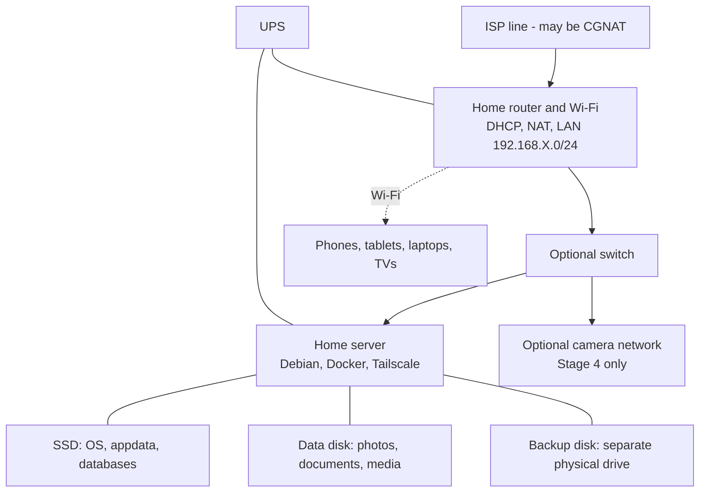

### 2.2 Three doors into the server

Public traffic and private traffic use **different Docker networks**. A container joins only the networks it needs.

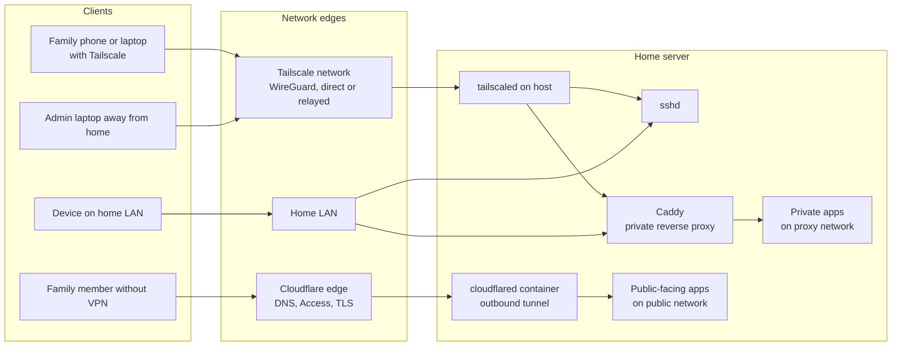

### 2.3 Host, containers and storage

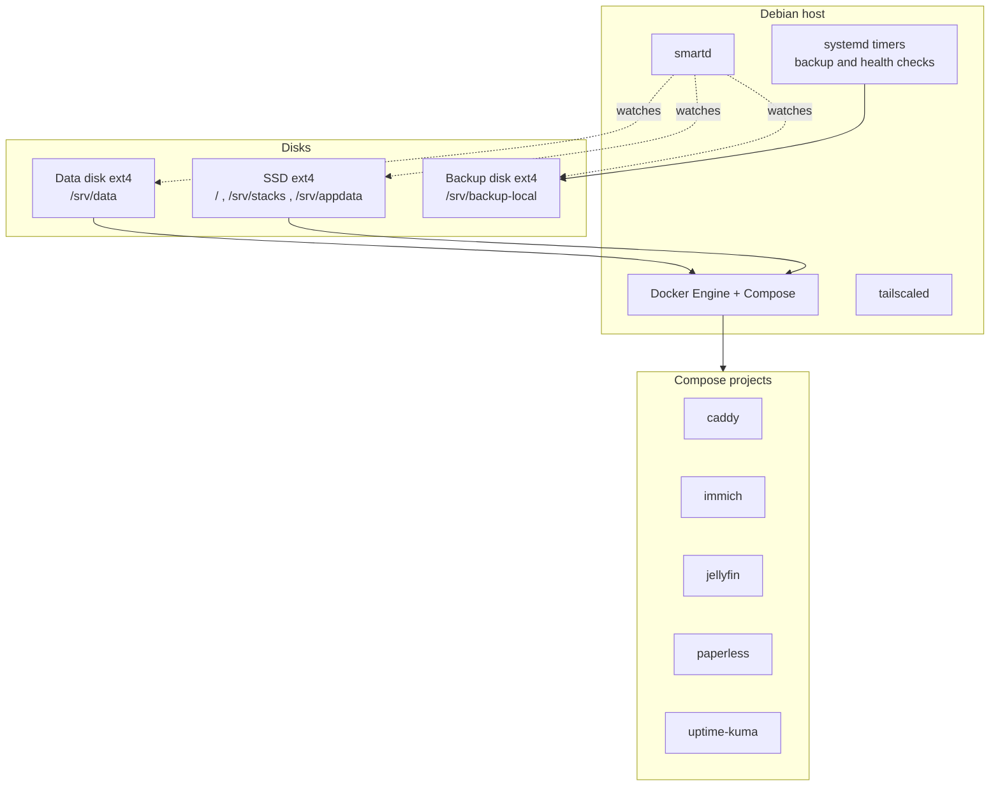

### 2.4 Backup paths (3-2-1 target)

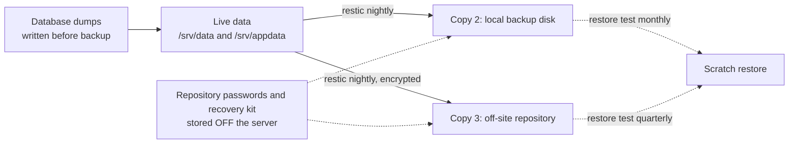

Copy 1 is the live data itself. A second disk in the *same* box is not off-site; the off-site copy is what survives theft, fire, flood and a power surge.

## 3. Vocabulary: five different "addresses" for one service

| Name | Example | Who uses it | Notes |
|------|---------|-------------|-------|
| Internal Docker port | `app:8080` on a Docker network | Other containers (Caddy, cloudflared) | Never reachable from outside unless published |
| Host port | `127.0.0.1:8080` or `192.168.X.10:8080` | Whoever can reach that host address | Docker publishes to **all interfaces** unless you give an address, and it bypasses ufw **[V]** |
| LAN address | `192.168.X.10` | Devices on the home network | Give the server a DHCP reservation or static IP |
| Tailscale address | `100.x.y.z` and `server.<tailnet>.ts.net` | Devices in your tailnet | Same address from anywhere |
| Public hostname | `share.example.com` | Anyone Cloudflare lets through | Exists only for services you deliberately publish |

Rule: publish host ports to `127.0.0.1` (or the Tailscale IP) and let Caddy or cloudflared reach the container over the Docker network. Docker documents the `127.0.0.1:` form for this **[V]**.

## 4. Request flows

### 4.1 Phone to a private photo service (Tailscale)

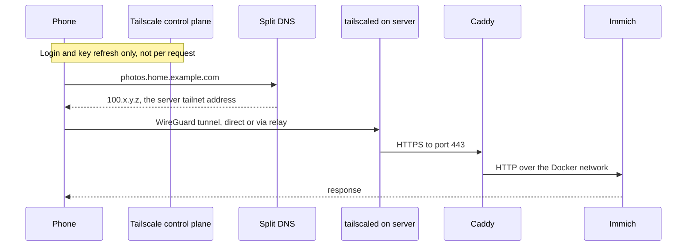

Trust: the tailnet policy decides *which* devices may open port 443 on the server. The photo app still requires its own login.

### 4.2 Computer on the home LAN

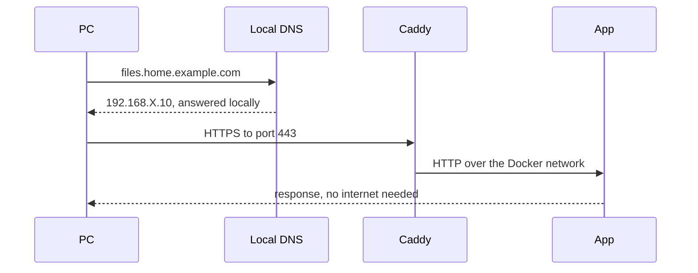

Works during an internet outage as long as the certificate is still valid (see 6).

### 4.3 Family member to a deliberately public service (Cloudflare)

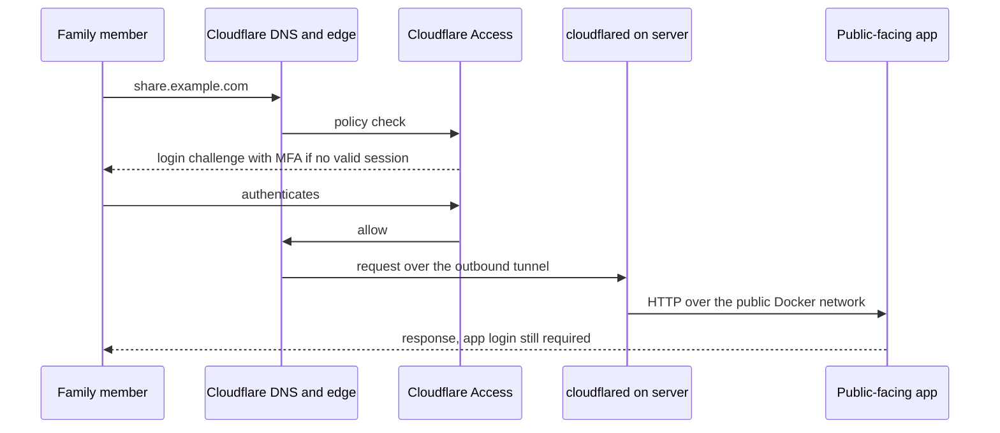

Cloudflare Access is a *front door*; it does not replace the app's own authentication. Only services that survive the limits in section 7 belong here.

### 4.4 Remote administrator

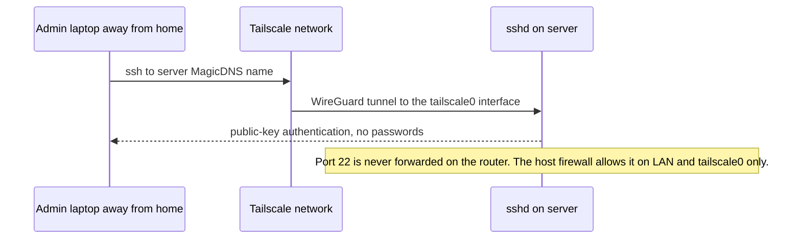

### 4.5 A device using network-wide ad blocking

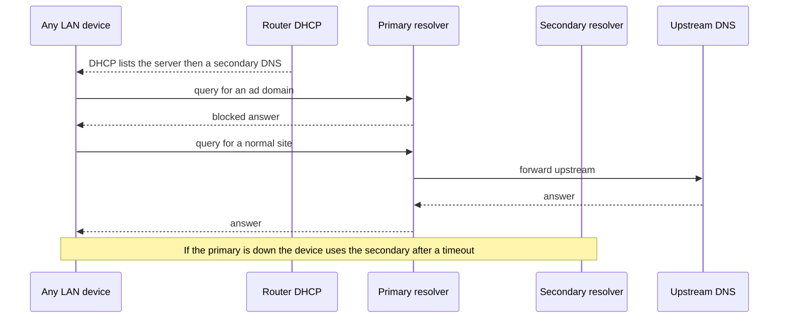

Some phones and browsers use their own encrypted DNS and bypass this entirely; see Part E-I.

### 4.6 Client to the media server

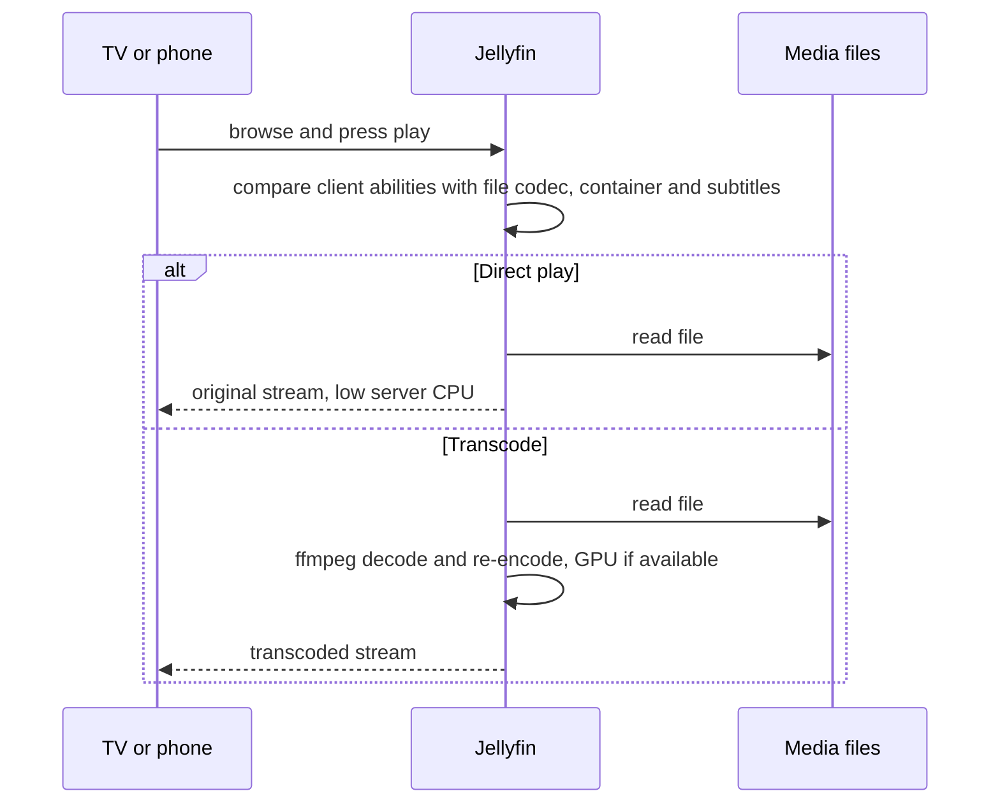

### 4.7 Off-site encrypted backup

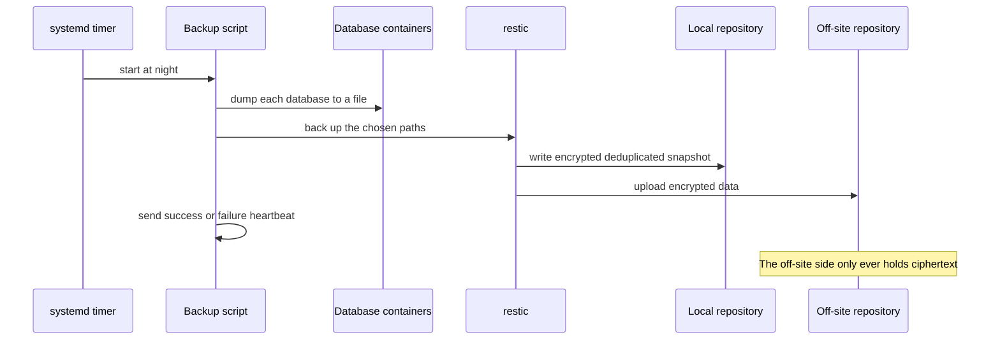

## 5. Dependencies

| Component | Needs | Fails how |
|-----------|-------|-----------|
| Every container | Docker, the bind-mounted paths existing | Starts against an empty directory if a mount is missing (guard in `02a-storage-layout.md`) |
| Immich | PostgreSQL on **local SSD, never a network share**; ML container; thumbnail/transcode space adds 10-20% **[V]** | Slow or corrupt DB if on slow/network storage |
| Paperless-ngx | PostgreSQL (recommended for new installs) and a Redis-compatible broker; optional Tika/Gotenberg **[V]** | Ingestion stalls if broker is down |
| Nextcloud | Database (PostgreSQL/MariaDB), PHP runtime **[V]** | Heavier to maintain than the other file options |
| Caddy | Reachable DNS provider API + ACME CA for issuance and renewal **[V]** | Cert expiry if renewal fails for long |
| cloudflared | Outbound access to Cloudflare | Public hostnames go down; private access unaffected |
| Tailscale | Outbound access to its control plane for logins and key changes **[K]** | New connections and policy changes blocked in an outage |
| Backups | Both repos reachable; passwords/keys stored off-box | Silent staleness if not monitored |
| Monitoring | An *external* check for total-failure cases | A dead server cannot report itself |

## 6. What keeps working when something breaks

| Event | Stops | Keeps working | First diagnostic |
|-------|-------|---------------|------------------|
| **Internet outage** | Remote (Tailscale) access, public services, off-site backup, certificate renewal, new image pulls, push alerts leaving the house, uncached public DNS lookups | Everything on the LAN via LAN names/IPs, SMB/Syncthing on LAN, Jellyfin direct play, local DNS rewrites and cached answers, local backups, local checks | Router WAN status; `ping` a gateway then a public IP then a name |
| **DNS provider (Cloudflare DNS) outage** | Public hostnames, DNS-challenge issuance/renewal | Internal names, **if** they are answered by your own DNS (split DNS); Tailscale; LAN | Query your own resolver vs a public one |
| **Cloudflare Tunnel/Access outage** | Public services only | All private access | `cloudflared` container logs |
| **Tailscale control-plane outage** | New logins, new devices, key rotation, policy edits, MagicDNS updates | Existing tunnels generally continue **[K]**; LAN access unaffected | `tailscale status`, `tailscale netcheck` |
| **Relay (DERP) problems** | Connections that cannot go direct | Direct peer-to-peer connections | `tailscale ping` (shows direct vs relay) |
| **Router failure** | LAN, Wi-Fi, internet, DHCP | Server stays up; recovers when the router returns | Spare router + saved config; DHCP reservation notes |
| **Server down** | All hosted services; household DNS if it is the only resolver | Router, internet for non-DNS-dependent use, cloud services | Out-of-band check (external monitor) |
| **System SSD dies** | OS, containers, databases, appdata | Data disk and backups intact | Rebuild host from Git + restore appdata (DR runbook, Part J) |
| **Data disk dies** | Libraries and apps that need them (apps should *stop*, not recreate empty folders) | OS, SSD services, Tailscale | `smartctl`, `dmesg`, `findmnt` |
| **Backup disk dies** | Local restore point | Everything else; off-site copy | Alert; replace; take a fresh backup |
| **Power loss, no UPS** | Everything; risk of unclean shutdown | Journaling filesystems usually recover but a mid-write database may not | UPS + graceful shutdown (Part J phase 2) |
| **Caddy down** | HTTPS names for private apps | Tailscale/LAN SSH; localhost-bound ports via an SSH tunnel | `docker compose ps`, Caddy logs |
| **Ad-block resolver down** | DNS for devices that only know that resolver | Devices with a working secondary | Second DNS server in DHCP |

Certificate note **[V/K]**: Caddy manages issuance and renewal automatically; it starts renewal well before expiry **[K]**, so a short internet outage does not expire certificates, but a multi-week outage can. Certificate lifetimes across public CAs are being shortened over the next few years **[K]**, so never rely on manual renewal.

## 7. Trust boundaries

| Zone | Contains | Who can reach it | Main controls |
|------|----------|------------------|---------------|
| Internet | Everyone | - | Nothing of yours listens here by default |
| Cloudflare edge | Public hostnames, Access policies | Anyone passing the Access policy | Access + app login + minimal public app set |
| Tailnet | Your devices and shared users | Devices permitted by the tailnet policy | Device approval, ACL/tags, key expiry, MFA on the identity provider |
| Home LAN | Family devices, IoT, guests | Anything on Wi-Fi/Ethernet | Segment IoT/guests/cameras where the router allows |
| Host | Debian, Docker daemon | Admin over SSH | Keys only, firewall, no Docker socket sharing |
| Docker networks | Containers | Only attached containers | Separate networks per stack; `internal` where no egress is needed |
| Data | Disks, repos | Mounted into specific containers | Least-privilege mounts, read-only where possible |

## 8. Limits of the public door (decides what may go behind Cloudflare)

| Constraint | Detail | Source |
|-----------|--------|--------|
| Upload size | Request bodies capped at 100 MB on Free and Pro (Business 200, Enterprise 500); larger gets a 413 | **[S]** Cloudflare docs |
| Video/large files via the CDN | The old "section 2.8" was replaced by a CDN-specific term; serving video or large files through the CDN is tied to Cloudflare's own paid services. Exact current wording not verified | **[S]** blog.cloudflare.com/updated-tos; **[U]** current text |
| Protocols on a Tunnel public hostname | HTTP, HTTPS, UNIX sockets, and TCP (TCP clients need `cloudflared` locally). No documented anonymous public UDP | **[S]** |
| Arbitrary TCP/UDP for the public | Cloudflare Spectrum: not on Free; Pro has only Minecraft and SSH (one app each); Business adds RDP; generic TCP/UDP is Enterprise | **[S]** |
| Private TCP/UDP | Possible with WARP + Tunnel (client-side agent), not for anonymous visitors | **[S]** |

Consequences: photo/video apps, media streaming and game servers are **not** good fits for the Cloudflare door. Tailscale (installed on the user's device, or node sharing) is the better route for them. A small web app with small payloads (a shared-file page, a status page, a form) is a reasonable fit.

## 9. Open questions that change the diagrams

1. Is a public IPv4 address available, or is the connection behind CGNAT? (`11-information-needed.md`)
2. Does the router support DHCP reservations, custom DNS in DHCP, VLANs and a second DNS option?
3. Is there a second always-on device (even a Raspberry Pi) for the secondary resolver and external heartbeat?
