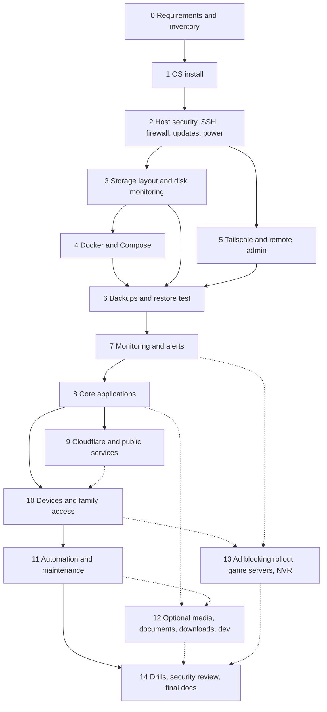

# Part J - Phased implementation roadmap

Hardware is still unknown, so this roadmap lists **tasks, validations, rollback and completion criteria** per phase. Exact commands are not dumped here: for each phase I will give you a small batch, explain it, ask for the (redacted) output, and interpret it before continuing. Install steps are verified against the project's current official docs at that moment, not from memory.

Command labels used from now on: **[R]** read-only, **[W]** changes configuration or state, **[D]** destructive or hard to reverse (always preceded by target verification and a backup). Never paste passwords, auth keys, tokens, private keys or recovery codes into chat; use placeholders and I will show where to insert the real value locally.

> **Constrained hardware?** If the machine is an old laptop with 4-8 GB RAM, a ~256 GB disk and a slow uplink, follow [`13-low-end-profile.md`](13-low-end-profile.md) for which phases to do, in what order, and which to skip.

## Dependency map

Solid arrows are hard prerequisites. Dashed arrows are optional or conditional.

### What can run independently

| Independent of | Can be done in parallel | Notes |
|----------------|-------------------------|-------|
| Phase 5 (Tailscale) | Phase 3 (storage) and Phase 4 (Docker) once Phase 2 is done | Tailscale only needs the host and your account |
| Domain purchase / Cloudflare account | Anything before Phase 8 | Buy early, use later; do not publish anything yet |
| Documentation | All phases | Update the inventory as each phase completes |
| Off-site account setup | Phases 3-5 | Needed by Phase 6 |
| Optional apps (12, 13) | Each other | No optional app is a prerequisite for core infrastructure |

Hard gate: **no public exposure (Phase 9) until Phase 6 (restore-tested backups) and Phase 7 (alerts) are complete.**

---

## Phase 0 - Requirements and hardware inventory

| | |
|---|---|
| Objective | Know the machine, network, users and priorities; pick the tier; fix Stage 1 scope |
| Prerequisites | None |
| Tasks | Answer `11-information-needed.md`. Run the read-only inventory commands in Part D section 10 **[R]**. Find out whether the ISP uses CGNAT (compare the router's WAN address with the address an external "what is my IP" site reports; an address in 100.64.0.0/10 or a mismatch suggests CGNAT **[K]**). Check IPv6 availability. Measure idle power with a plug-in meter. List the devices that need access. Create a **private** Git repo for `server-config` (this blueprint repo is public). Decide where the off-site backup will live. |
| Config produced | Hardware and requirements records (in the private repo) |
| Expected outcome | Tier chosen; Stage 1 scope agreed; list of unknowns |
| Security checks | Nothing sensitive in the public repo; note router admin password policy |
| Validation | I can restate your hardware, network constraints and priorities back to you correctly |
| Common failures | Disks with unknown health; BIOS password unknown; router locked by ISP |
| Rollback | n/a |
| Done when | Tier and Stage 1 scope are written down |

## Phase 1 - Operating-system selection and installation

| | |
|---|---|
| Objective | Debian 13 headless, bootable unattended, rebuildable |
| Prerequisites | Phase 0; a second computer; a USB stick; console access (screen + keyboard) for the install |
| Tasks | Download the installer from Debian's official site and **verify the checksum/signature** **[R]**. Set firmware options: UEFI boot, power-on after AC loss, sleep disabled. Install with SSH server and standard utilities only (no desktop). One SSD: EFI + ext4 root (+ swap file or zram). Create the admin user; set the hostname. Give the server a DHCP reservation in the router. Record disk and network facts. |
| Config produced | Hostname, admin user, partition notes, DHCP reservation notes |
| Expected outcome | Server boots unattended and answers on the LAN |
| Security checks | No default credentials; no network services beyond SSH |
| Validation | Reboot test; from another machine, SSH to the LAN IP; `hostnamectl`, `lsblk -f`, `ip -br a`, `timedatectl` **[R]** |
| Common failures | Wrong boot mode; NIC driver missing on very new hardware (then consider Ubuntu 26.04 LTS or a backports kernel) **[K]**; installer picks the wrong disk |
| Rollback | Reinstall (nothing valuable exists yet) **[D]** only if the right disk is confirmed |
| Done when | Headless reboot + LAN SSH works |

## Phase 2 - Host security, SSH, firewall, updates, power

| | |
|---|---|
| Objective | A hardened baseline before anything is added |
| Prerequisites | Phase 1; keep console access until verified |
| Tasks | Generate an SSH key (with a passphrase) on your admin machine; install the public key; disable password and root login with a **drop-in** file; test in a second session before closing the first **[W]**. Host firewall (ufw) with default-deny inbound, allowing SSH from the LAN (tailnet later) - remembering Docker bypasses ufw for published ports **[V]**. Automatic security updates **[W]**. Time sync. Journald size limits. Power: firmware auto-restart; plan a UPS and put the router/ONT on it too (see [`04-power-physical.md`](04-power-physical.md)); decision and prices in Part I. Note recovery steps for a broken sshd config. |
| Config produced | `sshd` drop-in, firewall rules, unattended-upgrades config |
| Expected outcome | Keys-only SSH, deny-by-default inbound, auto security patches |
| Security checks | `ss -tlnp` shows only SSH (and DNS client stuff) **[R]**; no listening service you didn't choose |
| Validation | Password SSH attempt is refused; `sudo ufw status verbose`; `timedatectl`; `systemctl list-timers`; reboot test **[R]** |
| Common failures | Locking yourself out (mitigation: second session, `sshd -t` before reload, console access); wrong firewall order |
| Rollback | Remove the drop-in, reload sshd, or use the console |
| Done when | Keys-only SSH verified from the admin machine; firewall active; updates scheduled |

## Phase 3 - Storage layout, filesystems, permissions, disk monitoring

| | |
|---|---|
| Objective | The `/srv` tree from `02a-storage-layout.md`, safe mounts, SMART monitoring |
| Prerequisites | Phase 2; spare disks attached |
| Tasks | Identify every disk by **serial** **[R]**; capture a SMART baseline **[R]**; partition/format the data and backup disks with labels **[D: verify the target twice]**; add UUID entries to `/etc/fstab` with `nofail`; create mount points and set them immutable while unmounted **[W]**; create sentinel files; create the `/srv` directories; choose numeric UIDs/GIDs; configure `smartd`; write the disk-space/mount check script. |
| Config produced | fstab, directory tree, ID table, smartd config |
| Expected outcome | Reboot mounts everything; a missing mount is detected |
| Security checks | Backup disk not exported over SMB; modes per `02a` table |
| Validation | `findmnt -R /srv`, `df -h`, `lsblk -f`, `smartctl -H` **[R]**; **unmount test**: unmount the data disk and confirm writes to the bare mountpoint fail **[W]** |
| Common failures | Formatting the wrong disk; fstab typo (boot to emergency shell; `nofail` limits the damage); SMR/USB bridge quirks |
| Rollback | Restore `/etc/fstab` from the saved copy; disks are re-formattable only before data lands |
| Done when | Reboot test passes; unmount test behaves as designed; SMART baseline stored |

## Phase 4 - Docker Engine and Compose

| | |
|---|---|
| Objective | A working, hardened container runtime and the Compose conventions from Part C |
| Prerequisites | Phases 2-3 |
| Tasks | Install Docker Engine and the Compose plugin from Docker's official apt repo for Debian **[W]** (steps verified live; the documented platform list includes Debian 13 **[V]**). Configure log rotation. Decide whether the admin user joins the `docker` group (root-equivalent **[K]**). Create the `proxy` and `public` networks. Build a throw-away test project that demonstrates a bind mount with `create_host_path: false`, a healthcheck, a restart policy, a memory limit, `depends_on` with `service_healthy`, and container recreation without data loss. Initialise the private Git repo at `/srv/config`. |
| Config produced | `/etc/docker/daemon.json`, the test project, networks |
| Expected outcome | Standard project pattern proven end to end |
| Security checks | Nothing published unintentionally: `ss -tlnp`, `docker ps --format ...` **[R]**; test that a deliberately published port is reachable despite ufw, then re-bind it to `127.0.0.1` **[V behaviour]** |
| Validation | `docker version`, `docker compose version`, `docker info`, `docker compose config` **[R]**; destroy and recreate the test container and confirm data survives |
| Common failures | Using `docker-compose` (legacy); firewall tooling that writes raw `nft` rules (unsupported with Docker **[V]**); missing mount makes a bind source appear empty |
| Rollback | Stop the stack; remove the packages. Removing `/var/lib/docker` is **[D]** and not needed for rollback |
| Done when | The "destroy container, data survives, missing mount refuses to start" tests pass |

## Phase 5 - Tailscale, private DNS, remote administration, access policies

| | |
|---|---|
| Objective | Private remote access that does not depend on open ports |
| Prerequisites | Phase 2 (can run in parallel with 3-4) |
| Tasks | Create the tailnet under an identity account with MFA. Install Tailscale on the host from the official repo **[W]**. Authenticate interactively (do not paste auth keys into chat). Tag the server and turn off key expiry for it **[K]**. Install clients on your devices. Enable MagicDNS. Write a minimal access policy: admins reach SSH; later, family devices reach only the proxy ports. Allow SSH on `tailscale0` in the firewall. Practise: `tailscale status`, `tailscale ping`, `tailscale netcheck` **[R]**. Optional labs: subnet router (IP forwarding, advertise routes, approve in the console, overlapping-subnet check), exit node, Tailscale SSH. Write the lost-device and revoke-device procedures. |
| Config produced | Tailnet policy file (kept in the private repo), firewall rule, DNS settings |
| Expected outcome | SSH from a phone on cellular works; LAN remains a break-glass path |
| Security checks | MFA on the tailnet identity; new devices need approval; no admin service reachable from unrelated devices |
| Validation | Connect from outside the home network; `tailscale ping` shows direct or relayed; revoke a test device and confirm it loses access |
| Common failures | Policy too strict (lockout - keep LAN SSH); CGNAT forces relays (slower, still works); LAN subnet overlaps a remote site; free-plan limits differ from what you expect (reported 6 users / unlimited devices **[S]**, confirm on the pricing page) |
| Rollback | `tailscale down`; remove the node in the admin console; revert policy to the previous version |
| Done when | Break-glass (LAN) and remote (tailnet) paths are both tested and documented |

## Phase 6 - Backup foundation and recovery testing

| | |
|---|---|
| Objective | Tested restores before any real data arrives |
| Prerequisites | Phases 3, 4, 5; an off-site target chosen (Part I) |
| Tasks | Create two restic repositories (local backup disk and off-site) with **separate passwords** **[W]**; store the passwords in the recovery kit **off the server** **[K]**. Write the backup script (logging, `set -euo pipefail`, lock to prevent overlap, dry-run flag, exit codes, heartbeat call). Create the systemd service + timer (`Persistent=true`, `OnFailure=` alert). Define retention and when `forget --prune` runs; schedule `restic check` regularly and a partial data read periodically. Run the first backup on a sample dataset. Perform restore tests: one file, one directory, and a full restore into a scratch location. Record RPO/RTO. |
| Config produced | Script, unit + timer, retention policy, recovery-kit contents list |
| Expected outcome | Nightly backup runs, alerts on failure, and has been restored |
| Security checks | Backup credentials separate from admin credentials; off-site token has the least rights the provider allows; repo passwords not on the server unprotected |
| Validation | Checksums of restored files match; stopping the timer or breaking credentials triggers the alert; `restic snapshots`, `restic check` **[R]** |
| Common failures | Lost repository password (data unreadable); backing up live DB files; clock skew; off-site upload too slow for the first seed (plan weeks) |
| Rollback | Disable the timer; repositories remain intact |
| Done when | A restore **from the off-site repo** succeeded and a simulated failure produced an alert |

## Phase 7 - Initial monitoring and alerts

| | |
|---|---|
| Objective | Hear about problems before the family does; hear about total failure from outside |
| Prerequisites | Phase 6 |
| Tasks | Choose a push channel and test it. Configure `smartd` notifications. Add checks for disk space, mounts/sentinels, backup age, memory pressure, temperature, restart loops. Add an **external heartbeat** (dead-man's-switch) and a basic external reachability check. Define severities: *critical* (act today), *warning* (this week), *info* (digest only). |
| Config produced | Check scripts + timers, notification config, alert matrix (Part H) |
| Expected outcome | Each alert has fired once on purpose |
| Security checks | Notification secrets stored with 0600 permissions; messages leak no secrets |
| Validation | Fill a test volume past the threshold; unmount a test mount; stop the heartbeat; each produces exactly one actionable alert |
| Common failures | Alert fatigue; alerts that fail silently when the internet is down; the monitor on the same box as what it monitors |
| Rollback | Disable timers |
| Done when | Every Stage 1 alert was fired deliberately and received |

## Phase 8 - Core applications

| | |
|---|---|
| Objective | The Stage 2 services, one at a time, each with backup and restore notes |
| Prerequisites | Phases 4, 5, 6, 7; a domain if you want HTTPS names (otherwise MagicDNS + `tailscale serve`) |
| Order | (a) Caddy with DNS-challenge certificates and internal names; (b) AdGuard Home as internal DNS (rewrites) on one test device first; (c) Uptime Kuma; (d) file access (Samba and/or Syncthing); (e) Immich; (f) Jellyfin if you have media; (g) Paperless-ngx if you have paper; (h) Vaultwarden last, only with proven backups |
| Per-app tasks | Read the app's current official install doc; pin versions; write `compose.yaml`; attach only needed networks; add healthchecks and limits; wire the reverse proxy; classify exposure (Part E service-exposure matrix); add backup entries and the DB dump step; write update and rollback notes; record ports/paths/IDs in the inventory |
| Validation per app | Functional test; reboot test; **restore rehearsal** into a scratch location; permission check from inside the container; confirm it is unreachable from where it shouldn't be |
| Common failures | Postgres on slow storage **[V]**; proxy header/WebSocket/upload-size issues; wrong UID on bind mounts; missing mount |
| Rollback | `docker compose down` (no `-v`); restore appdata and DB dump from backup |
| Done when | Every app has passed a restore rehearsal |

## Phase 9 - Cloudflare, public DNS, reverse proxy, selected public services

| | |
|---|---|
| Objective | The few intentionally public services, behind Cloudflare Access, with no inbound ports |
| Prerequisites | **Phases 6 and 7 complete**; each candidate service reviewed against Part B section 8 limits and the Part E exposure matrix |
| Tasks | Put the domain's DNS on Cloudflare; create a Tunnel with `cloudflared` on the `public` Docker network **[W]**; create public hostnames only for approved services; create Access policies (identity, MFA, session length); keep the app's own authentication on; consider rate limiting and WAF options available on your plan (verify; free-plan features differ); document the **kill switch** (disable hostname/tunnel). |
| Config produced | Tunnel + Access config (stored as notes; tokens in `/srv/secrets`), DNS record list |
| Expected outcome | Only intended hostnames resolve publicly; unauthenticated requests are stopped by Access |
| Security checks | No router port-forwards; no internal names in public DNS; an external port scan of your home IP shows nothing open; Docker published ports bound to localhost |
| Validation | From a non-tailnet device: Access prompts; after login, the app works; after revoking the user, access ends; kill switch tested |
| Common failures | Uploads over 100 MB fail **[S]**; video streaming restricted **[S]/[U]**; WebSocket/streaming apps misbehave; treating Access as a replacement for app authentication |
| Rollback | Disable the public hostname or stop `cloudflared`; private access is unaffected |
| Done when | Kill switch works and the exposure inventory matches reality |

## Phase 10 - Device integration and family access

| | |
|---|---|
| Objective | Each family member can do their top tasks without touching administration |
| Prerequisites | Phase 8 (Phase 9 optional) |
| Tasks | Per device class (Part F): Tailscale, the right native app vs browser vs network share; Samba drive mapping; Syncthing; Immich background upload (note iOS limits); Jellyfin on TVs; individual accounts with MFA; storage quotas where supported; onboarding and offboarding checklists; lost-device drill (revoke device, rotate sessions/passwords). |
| Validation | Each person completes their top three tasks from home and away; offboarding removes access; a lost-device drill is run once |
| Common failures | Smart-TV client gaps; iOS suspends background uploads; shared accounts blur ownership |
| Rollback | Remove the user/share/device; data remains with the owner's directory |
| Done when | Family tasks verified and the lost-device procedure rehearsed |

## Phase 11 - Automation and maintenance workflows

| | |
|---|---|
| Objective | Boring, safe, logged automation |
| Prerequisites | Phase 10 |
| Tasks | Formalise timers: backups, checks, update *checker* (notify only), log/temp cleanup (dry-run first), certificate expiry, weekly health digest. Write the update policy: OS security patches automatic; Docker Engine and app images updated manually in a maintenance window after a verified backup; DB major upgrades only with a tested dump and rollback. For every automation fill in: trigger, action, permissions, logs, failure detection, retry, data-loss potential, disable method, safe test. Human approval for anything destructive, firewall-risky, or public-exposure-changing. |
| Validation | Dry-run logs reviewed; each automation disabled and re-enabled once; a failing one produces an alert |
| Done when | All automations have the safety table and have been tested |

## Phase 12 - Optional media, document, download and development services

Not required for the core. Each item stands alone: Jellyfin hardware acceleration and library organisation; the download/arr stack (legal content only; UI kept private; media and downloads on one filesystem for hardlinks); Paperless ingestion workflow; Forgejo and code-server with separate isolation from public services. Gate: measured headroom from Phase 7 monitoring.

## Phase 13 - Optional ad blocking rollout, game servers, CCTV/NVR

- **Ad blocking**: AdGuard Home already exists as internal DNS (Phase 8b). Household rollout = point router DHCP at it **and** a second resolver that filters identically (clients may use either, so both must apply the same blocklists and local records), trial with one device first, document the fallback if it fails, never publish port 53. (This phase is reordered earlier in practice because split DNS needs an internal resolver.)
- **Game servers**: gate on capacity (Part D), the CGNAT answer, and an exposure decision; own Docker network, resource limits, no access to personal data, save backups, on-demand start/stop. Cloudflare Tunnel does not carry arbitrary game UDP **[S]**.
- **CCTV/NVR**: gate on a dedicated disk, a camera network with no internet, the retention policy, and enough CPU/iGPU for decode/detection (Part D section 6).

## Phase 14 - Recovery drills, security review, documentation, final validation

| | |
|---|---|
| Drills | (1) restore a deleted file; (2) restore a corrupted app; (3) rebuild a failed database from dump; (4) restore a photo library from off-site; (5) rebuild after a system-SSD failure on spare hardware or a VM; (6) full rebuild from nothing using only Git + backups + the recovery kit |
| Security review | Walk the threat model (Part G): exposure inventory, Tailscale device/user audit, Cloudflare Access users, credential rotation, update status, backup credential scope, SSH config, Docker socket/privilege audit |
| Documentation | Inventory templates (Part K) filled in the **private** repo; a one-page "what to do if I'm unavailable" for family |
| Done when | Measured RTO/RPO are recorded; docs match reality; a full-loss rebuild has been rehearsed |

---

## Interaction protocol for implementation

1. I present one phase at a time with the exact commands for the next small step, labelled **[R]/[W]/[D]** and stating where it runs (host vs inside a container) and what it changes.
2. You run it and paste the output with secrets redacted; I interpret it before the next step.
3. No step proceeds past a failed critical validation.
4. `STATE.md` is updated after each step so the repo always reflects what is actually done.
