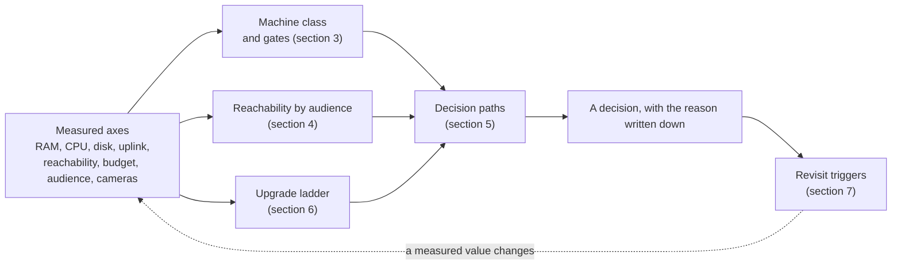
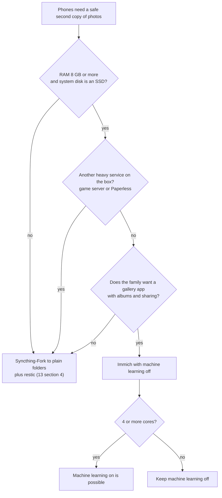
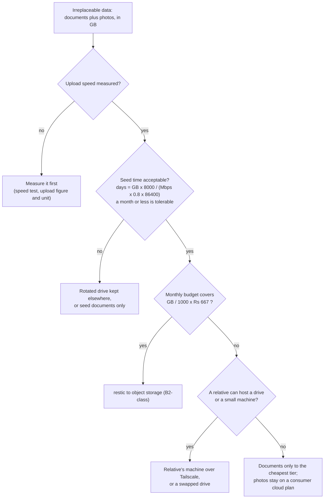
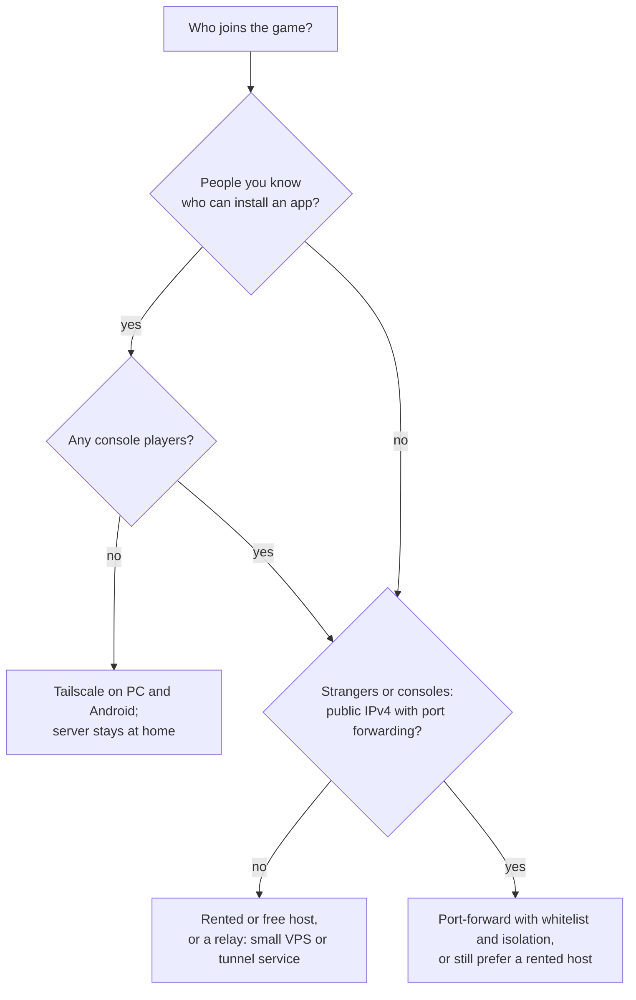
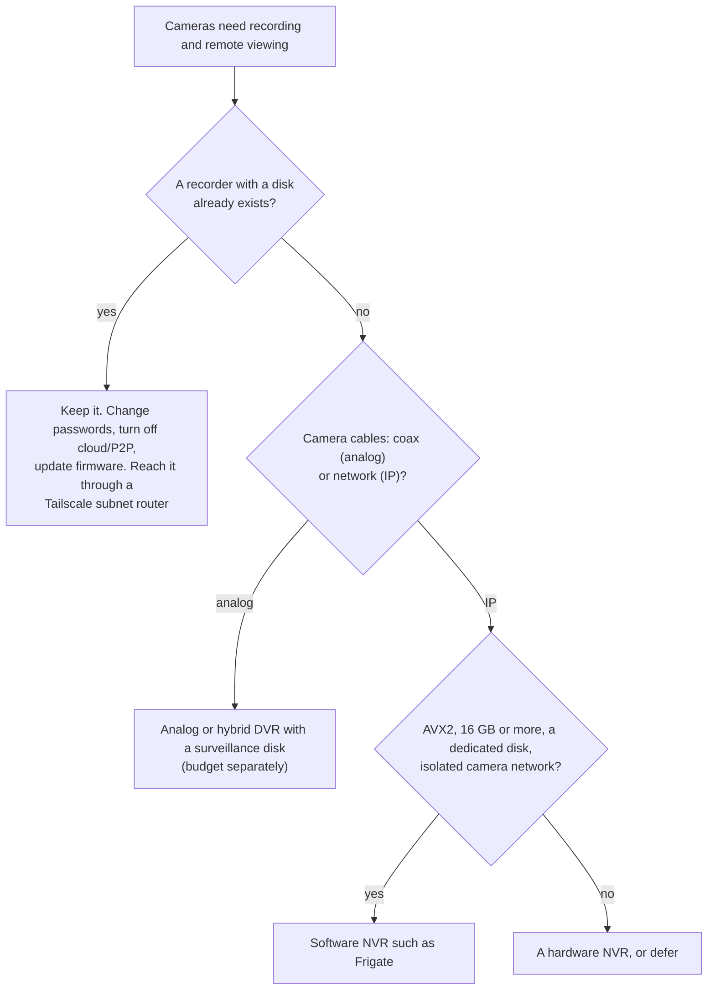
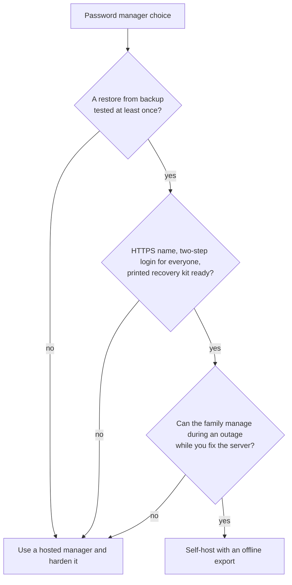
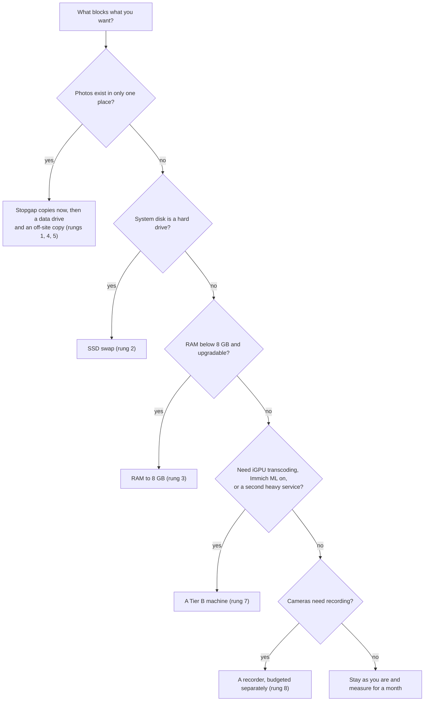

# Decision guide: choosing by the variables that change

A chart for deciding **later**, when hardware, budget, internet connection or household change. It is built on the *variables* (RAM, disk, CPU generation, uplink, reachability, budget, audience, cameras), not on any one person's setup. The owner's current position is shown in [section 9](#9-where-the-example-profile-sits) as **one example only**; replace it with your measured values and every chart below still applies.

Labels as everywhere: **[V]** verified in the project's own docs, **[S]** search summary, **[K]** stable knowledge, **[E]** estimate to measure, **[U]** unverified, **[C]** low-confidence price. IDs (V5, S9 ...) are in [`12-verification-log.md`](12-verification-log.md). Abbreviations for references: `03` = [`03-hardware-capacity.md`](03-hardware-capacity.md), `13` = [`13-low-end-profile.md`](13-low-end-profile.md), `08` = [`08-cost.md`](08-cost.md), `06` = [`06-security-backup.md`](06-security-backup.md), `apps/X` = [`apps/`](apps/README.md) category X.

> **Advisory, not authoritative.** These ratings come from the published minimums and estimates in the cited documents. A measured week of real use (`03` section 10) beats any chart. Where this guide refines a rating in `03` or `13`, the notes column says so; it never silently contradicts them.

## 1. How to use this guide

1. **Measure** the axes in section 2 (every command is read-only).
2. **Find your machine class** in section 3 and read the rows you care about. The notes column says what would move a row up.
3. **Check reachability** for the audience you have in section 4 (household, invited people, strangers).
4. **Pick a path** in section 5 for the decision in front of you (photos, off-site backup, game hosting, cameras, passwords, what to buy).
5. **Price the next step** in the upgrade ladder (section 6), then glance at the gates in section 3.3.
6. **Write down what would change your mind** (section 7) so the next decision starts from a trigger, not a mood.
7. Before committing to something costly or awkward to undo, read section 8.

| If your question is | Go to |
|---------------------|-------|
| Can my machine run X? | Section 3 |
| Who can reach X, and how? | Section 4 |
| Which tool or option should I pick? | Section 5 |
| What should I buy next, and what will it unlock? | Sections 5 (last chart) and 6 |
| Something changed. What do I re-read? | Section 7 |
| How hard is this to undo? | Section 8 |

## Words used in this guide

| Word | Plain meaning |
|------|---------------|
| Uplink, upload speed | How fast your home can send data *out* to the internet. It limits cloud backups, remote streaming and game hosting |
| Port forwarding | A router setting that lets the internet reach one device at home. Nothing in this blueprint needs it by default |
| CGNAT | Your internet provider shares one public address between many customers, so nothing outside can connect in to your home, even if the router could forward ports |
| Tailscale | A private network between your own devices (and people you invite), so they reach the server from anywhere without opening your router |
| Class, tier | A rough size of machine, from A1 (small and old) to D (with a graphics card): section 3.1 |
| Direct play and transcoding | Direct play: the TV plays the file as stored, almost no work for the server. Transcoding: the server re-encodes the video on the fly, which is heavy work |
| Quick Sync (QSV) | Intel graphics hardware that transcodes cheaply. Linux supports it from Intel's 5th-generation (Broadwell) chips **[V24]** |
| ML (machine learning) | Immich's optional face and object recognition and smart search; the heaviest part of the photo app |
| DVR, NVR | A box with a hard disk that records cameras: a DVR for analog cameras (coax cables), an NVR for IP cameras (network cables) |
| Subnet router | A machine at home that lets your Tailscale devices reach other home devices, such as a DVR, that cannot run Tailscale themselves |
| Seed time | How long the first full copy to the off-site backup takes (section 2.3) |
| 3-2-1 | Three copies of the data, on two kinds of storage, one of them away from home |
| Relay (VPS) | A small rented server on the internet that passes visitors on to your home over a private tunnel |
| Gate | Something to *do* first (not buy) before a step is safe: section 3.3 |
| Heavy service | Immich, a game server or Paperless: the services that need a few gigabytes each |

## 2. The decision axes

### 2.1 What to measure

| Axis | Bands | How to measure (read-only) | What it decides |
|------|-------|----------------------------|-----------------|
| RAM | 4 GB, 8 GB, 16 GB, 32 GB or more | Linux `free -h`; Windows Task Manager > Performance > Memory | Which heavy service fits (`13` section 2; `03` section 3) |
| CPU generation and flags | No AVX; AVX only; AVX2; newer. Quick Sync on Linux from Broadwell **[V24]** | Linux `lscpu`; Windows Settings > System > About, then look the model up (section 2.2) | Frigate needs AVX and AVX2 **[V13]**; Immich's ML container needs x86-64-v2 **[V1]**; Jellyfin needs SSE4.1 **[V5]** and benefits from Quick Sync |
| System disk | Hard drive; SATA SSD; NVMe | Linux `lsblk -o NAME,SIZE,ROTA,MODEL` (ROTA 1 = spinning) | Immich keeps its database on local SSD **[V1]**; Docker and databases on a spinning laptop disk are slow |
| Data disks | None; one external; one internal; two or more | `lsblk`, `df -h` | Where photos and the backup copy live; whether 3-2-1 is possible (`06` section 5.1) |
| Uplink (upload speed) | 2 Mbps or less; 2-10; 10-20; 20 or more | A speed test; read the **upload** figure and its unit (Mbps or MB/s) | Off-site seeding time, remote streaming, remote camera viewing (section 2.3) |
| Inbound reachability | None (CGNAT, or a router that cannot forward ports); public IPv4 with forwarding; IPv6 only; relay (VPS or tunnel service) | Compare the router's WAN address with an external "what is my IP" page; 100.64.0.0/10 is CGNAT **[K]** | Whether anything can be hosted for people outside the house (section 4) |
| One-time budget | About Rs 5,000 or less; 5,000-15,000; 15,000-40,000; more | Decide | Which ladder rungs are reachable at once (section 6) |
| Monthly budget | About Rs 200 or less; 200-500; more. Includes electricity? | Decide | Off-site storage size, relay or hosting fees (`08`) |
| Audience | Household; invited people who can install an app; strangers | Ask who actually needs it | Section 4 |
| Cameras | None; analog with a DVR; IP with an NVR; cameras with no recorder. Count | Look at the cables (coax/BNC or network) and for a box with a disk | Path in section 5 (cameras) |
| Operator time and comfort | Hours per month; comfort with a command line | Ask honestly | How much complexity is sensible (`00` principle 6: the smallest tool that does the job) |

### 2.2 Reading "an old Core i3"

"An old Core i3" can mean anything from a 2010 to a 2017 machine, and three features decide which services it can run: **AVX2** (Frigate needs AVX and AVX2 **[V13]**), **x86-64-v2** (Immich's machine-learning container **[V1]**) and **Quick Sync on Linux** (Jellyfin transcoding, from Broadwell **[V24]**). The digits after `i3-` start with the generation: `i3-2310M` is 2nd, `i3-4005U` 4th, `i3-6006U` 6th; a three-digit number such as `i3-380M` is 1st generation. The table below is general knowledge **[K]**: confirm the exact part on Intel's product page or, better, by looking at the CPU flags on the machine itself.

| Generation | Codename, year | Mobile i3 examples | Cores / threads (mobile i3) | AVX | AVX2 | Linux Quick Sync **[V24]** |
|------------|----------------|--------------------|-----------------------------|:---:|:----:|----------------------------|
| 1st | Arrandale, 2010 | i3-330M, i3-380M | 2 / 4 | no | no | No (legacy VA-API only) |
| 2nd | Sandy Bridge, 2011 | i3-2310M, i3-2350M | 2 / 4 | yes | no | No (legacy VA-API only) |
| 3rd | Ivy Bridge, 2012 | i3-3110M, i3-3120M | 2 / 4 | yes | no | No (legacy VA-API only) |
| 4th | Haswell, 2013 | i3-4005U, i3-4030U | 2 / 4 | yes | yes | No (legacy VA-API only) |
| 5th | Broadwell, 2015 | i3-5005U, i3-5010U | 2 / 4 | yes | yes | Yes; H.264 |
| 6th | Skylake, 2015 | i3-6006U, i3-6100U | 2 / 4 | yes | yes | Yes; HEVC 8-bit |
| 7th | Kaby Lake, 2017 | i3-7100U | 2 / 4 | yes | yes | Yes; HEVC 10-bit |

What the table means for the matrix in section 3:

- **AVX2 first appears in the 4th generation (2013).** A 1st-3rd generation i3 cannot meet Frigate's AVX2 requirement **[V13]**, whatever its RAM. Many Pentium, Celeron and Atom parts lack AVX and AVX2 too (notably Celeron and Pentium models before the 2020 Tiger Lake generation **[V13]**, `03` section 1), so a model that merely says "Intel" proves nothing.
- **x86-64-v2 needs SSE4.2 and POPCNT**, which every Core i3 from the 1st generation has **[K]**; Immich's ML container is not blocked by CPU age (`03` says most CPUs from about 2012 qualify **[V1]**).
- **Quick Sync on Linux starts at the 5th generation (Broadwell)** **[V24]**; older Intel graphics use VA-API. A 4th-generation i3 meets Frigate's CPU requirement but can only use the legacy VA-API path for Jellyfin **[V24]**.
- **The test is the flags, not the name.** On Linux, `lscpu` lists them; `grep -o -w -E 'avx|avx2|sse4_2|popcnt' /proc/cpuinfo | sort -u` prints just the ones that matter (read-only). On Windows, Settings > System > About shows the model; look that exact model up.

### 2.3 Uplink bands: what each realistically supports

Seed time for the first off-site copy is `days = GB x 8000 / (Mbps x 0.8 x 86400)` (`06` section 5.7; `0.8` = realistic efficiency **[E]**). Remote video needs roughly the file's bitrate in upload; Jellyfin recommends at least 20 Mbps of upload for remote access and a bandwidth cap near 70% of upstream when under 100 Mbps **[V5]**.

| Upload | 100 GB seed | 300 GB seed | Remote video **[E]** | Camera viewing **[E]** |
|--------|-------------|-------------|----------------------|------------------------|
| 1 Mbps | 11.6 days | 34.7 days | No | One low-resolution sub-stream, if any |
| 2 Mbps | 5.8 days | 17.4 days | No | One sub-stream |
| 5 Mbps | 2.3 days | 6.9 days | At most one low-bitrate stream | One or two sub-streams |
| 10 Mbps | 1.2 days | 3.5 days | One or two modest streams | Several sub-streams |
| 20 Mbps or more | 0.6 days or less | 1.7 days or less | The level Jellyfin recommends for remote use **[V5]** | Comfortable |

Use restic's `--limit-upload` so the household can still use the line **[V]**; seed documents first, then photos by recency. If the plan is quoted as "4" with no unit, 4 Mbps and 4 MB/s (32 Mbps) differ eightfold: measure.

## 3. What each machine class can run

### 3.1 The classes

`03` section 1 rates whole tiers. Tier A spans 2-8 GB and hard drive or SSD, and two facts decide most rows there (RAM and system disk), so this guide splits Tier A in two and adds the refurbished office mini PC that often sits between Tier A and the new mini PC.

| Class | Typical machine | RAM | System disk | CPU | Basis |
|-------|-----------------|-----|-------------|-----|-------|
| **A1** | Old dual-core laptop | 4 GB | Hard drive | 2 cores; AVX2 unknown | `13` section 2; `03` Tier A |
| **A2** | Old dual-core laptop | 8 GB | SSD | 2 cores; AVX2 unknown | `13` section 2; `03` Tier A |
| **B1** | Refurbished office mini PC or small desktop: 4-core Core i5, 6th-9th generation | 8-16 GB | SSD | 4 cores, AVX2, Quick Sync **[V24]** | `03` Tier B; section 6 for prices |
| **B2** | New N100/N150-class mini PC | 16 GB | SSD | Low-power 4 cores with an iGPU Jellyfin and Frigate use as their example **[V5][V6]** | `03` Tier B; `08` price book |
| **C** | Workstation or desktop | 32-128 GB | NVMe plus several HDDs | 8-16 or more cores | `03` Tier C |
| **D** | C plus a GPU | 32 GB or more | NVMe plus HDDs | GPU | `03` Tier D |

**Legend.** ✅ comfortable. ⚠️ possible with caveats; the caveat is in the notes. ❌ not realistic. **¹** = on an 8 GB box this is the one heavy service (Immich, a Minecraft server or Paperless), not two (`13` section 2). Ratings for B2, C and D follow `03` section 4 exactly. A1 and A2 follow `13` where it speaks and are never more optimistic than `03` Tier A except where `13` says otherwise (noted). B1 follows Tier B but is marked more cautious where nothing verified covers its older iGPU.

**Example profile (provisional):** sits at A1 or A2 until its RAM and system-disk type are measured (section 9).

### 3.2 Workloads by class

**Foundation, files, photos, documents and identity**

| Workload | A1 | A2 | B1 | B2 | C | D | What moves it up, and the basis |
|----------|:--:|:--:|:--:|:--:|:-:|:-:|---------------------------------|
| Base stack: Tailscale, Caddy, restic, monitoring, AdGuard Home or Pi-hole, Syncthing, Samba | ✅ | ✅ | ✅ | ✅ | ✅ | ✅ | A second disk and an off-site target make the backups real (ladder rungs 4-6). `03` section 4 rows 1-2 |
| Photos as plain folders (Syncthing-Fork on phones plus restic) | ✅ | ✅ | ✅ | ✅ | ✅ | ✅ | The default on 4 GB or a hard drive. `13` section 4 |
| Immich, machine learning off | ❌ | ⚠️¹ | ✅ | ✅ | ✅ | ✅ | A1 has 4 GB and no SSD; Immich runs on 4 GB only with ML off and wants its database on local SSD **[V1]**. Rungs 2-3. `13` section 4; `03` Tier A ⚠️ |
| Immich, machine learning on | ❌ | ❌ | ✅ | ✅ | ✅ | ✅ | 8 GB and 4 cores recommended **[V1]**; the first ML pass on a 2-core CPU takes days **[E]**. `03` section 4 |
| Nextcloud | ⚠️ | ⚠️ | ✅ | ✅ | ✅ | ✅ | Small households only; add it only for calendar, contacts or office (`apps/B`). `03` section 4 |
| Paperless-ngx | ❌ | ⚠️¹ | ✅ | ✅ | ✅ | ✅ | About 1.5-2.5 GB plus OCR bursts **[E]**; on 8 GB and not together with Immich. `13` section 1 refines `03` Tier A ❌ |
| Self-hosted password manager (Vaultwarden) | ✅ | ✅ | ✅ | ✅ | ✅ | ✅ | Hardware is not the limit; readiness is (gates, section 3.3). A hosted manager needs no server at all (`apps/F`) |
| Single sign-on with Authentik (Authelia is lighter) | ❌ | ❌ | ⚠️ | ⚠️ | ✅ | ✅ | Authentik needs 2 or more cores and 2 GB **[V19]** and adds a critical component; not worth it below about three apps and several users (`apps/F`). `03` section 4 |

**Media and downloads**

| Workload | A1 | A2 | B1 | B2 | C | D | What moves it up, and the basis |
|----------|:--:|:--:|:--:|:--:|:-:|:-:|---------------------------------|
| Jellyfin, direct play on the home network | ⚠️ | ✅ | ✅ | ✅ | ✅ | ✅ | Library on an external drive mounted read-only; on 4 GB it is the only extra service. `13` sections 1-2; `03` section 4. A2 is a refinement of `03` Tier A ⚠️ |
| Jellyfin with transcoding | ❌ | ❌ | ✅ | ✅ | ✅ | ✅ | Needs a Quick Sync-class iGPU: Linux QSV from Broadwell **[V24]**; HEVC 8-bit from Skylake, 10-bit from Kaby Lake **[V24]**; software HDR tone-mapping is extremely demanding **[V5]**. On A-class machines plan for direct play. `03` section 4 |
| Download and library-management stack | ⚠️ | ⚠️ | ✅ | ✅ | ✅ | ✅ | Legal content only; IO-heavy (`apps/E`). `03` section 4 |

**Cameras, games, development, monitoring and AI**

| Workload | A1 | A2 | B1 | B2 | C | D | What moves it up, and the basis |
|----------|:--:|:--:|:--:|:--:|:-:|:-:|---------------------------------|
| Remote access to an existing DVR or NVR (Tailscale subnet router) | ✅ | ✅ | ✅ | ✅ | ✅ | ✅ | No recording on the server; Docker's forwarding policy must allow routing **[V2]**. `13` section 8; `apps/M` |
| Software NVR, 1-4 cameras with a detector | ❌ | ❌ | ⚠️ | ✅ | ✅ | ✅ | Needs AVX and AVX2, 4 GB or more, a detector and a dedicated disk **[V13]**. B1: detector speed on 6th-9th generation iGPUs is not in the docs I read **[U]**; B2: the N100 is Frigate's own example **[V6]**. `03` section 4 |
| Software NVR, 8 or more cameras with AI | ❌ | ❌ | ⚠️ | ⚠️ | ✅ | ✅ | 16 GB recommended for 8+ cameras **[V13]**; the N100 runs one detector instance **[V6]**. For 16 cameras a hardware recorder is usually simpler (section 5.4) |
| Small game server, a few players (Minecraft Java, vanilla) | ❌ | ⚠️¹ | ✅ | ✅ | ✅ | ✅ | Single-thread speed matters most **[K]**; about 3 GB with a 2 GB heap **[E]**; test with the real group (`apps/N`). `13` section 2; `03` section 4 |
| Several or modded game servers | ❌ | ❌ | ⚠️ | ⚠️ | ✅ | ✅ | 2-8 GB or more each **[E]** (`03` section 3). `03` section 4 |
| Git hosting plus code-server | ⚠️ | ⚠️ | ✅ | ✅ | ✅ | ✅ | Git alone is light; code-server is the heavy half (about 0.5-2 GB per active user **[E]**), and `13` section 1 says to skip it on the laptop class. `03` section 4 |
| Prometheus plus Grafana | ❌ | ❌ | ✅ | ✅ | ✅ | ✅ | About 0.5-1.5 GB **[E]**; not needed early (`apps/H`). `03` section 4 |
| Local LLM, small (about 3-8B, quantised) | ❌ | ❌ | ⚠️ | ⚠️ | ⚠️ | ✅ | CPU-only is slow: a few tokens per second on a mini PC **[E]**. `03` section 4 and 7 |
| Local LLM, large | ❌ | ❌ | ❌ | ❌ | ❌ | ⚠️ | VRAM-bound. `03` section 4 |

### 3.3 Readiness gates (not hardware)

A machine that *can* run something is not yet *ready* to. These gates come from the staged plan (`09a`), the roadmap (`09`) and the app pages. They cost time, not money.

| Step | Gate: must be true first | Why | Where |
|------|--------------------------|-----|-------|
| Putting any irreplaceable data on the server | A restore from backup has been tested once | A backup that was never restored is a hope | `06` section 5.8; `09` Phase 6 |
| A public hostname (Cloudflare Tunnel plus Access) | Restore-tested backups, alerts, the exposure checklist | Public exposure is the step that is hardest to take back | `apps/00-exposure-matrix.md`; `09` Phase 9 |
| Household-wide ad blocking (changing the router's DNS) | A second resolver exists, or the single-machine exception is accepted knowingly | One reboot otherwise cuts the whole home's internet | `apps/I`; `13` section 6 |
| Self-hosting passwords | Tested restores, HTTPS, two-step login for everyone, a printed recovery kit, and a family that can wait out an outage | There is no administrator reset for a forgotten master password **[K]** | `apps/F` |
| Single sign-on | Three or more apps and several users; a local admin login kept in every app | A mistake can lock everyone out | `apps/F` |
| Game server | Measured headroom (free RAM, CPU, disk) | A busy server competes with everything else on a small box | `apps/N`; `09` Phase 13 |
| A software NVR | AVX and AVX2, a dedicated recording disk, an isolated camera network | Recording must not be able to fill the OS disk | `apps/M` **[V13]** |
| Seeding the off-site copy | Upload speed measured, seed time acceptable | Section 2.3 | `06` section 5.7 |

## 4. Reachability by audience

Three audiences: the **household** (always the home network, or Tailscale away from home); **invited people** who can install an app; **strangers** who will not. Nothing here needs an inbound router port unless a row says so.

### 4.1 Media server (Jellyfin)

| Audience | What works | Limits |
|----------|------------|--------|
| Household | Direct play on the LAN; TV apps exist for Android TV/Fire OS, LG webOS, Samsung Tizen, Roku, tvOS and more, but check each TV model **[V14]** | Library on an external drive; no transcoding on A-class machines |
| Invited | Tailscale on a phone, PC or an Android TV/Apple TV device **[S26]**; smart TVs generally cannot run Tailscale **[K]** | Each remote stream needs about the file bitrate in upload; Jellyfin recommends 20 Mbps or more **[V5]** (section 2.3) |
| Strangers | Not advised, from any connection | Needs inbound reachability and a big uplink; Cloudflare's terms restrict serving video through its CDN unless you use its paid services **[S2][U2]**; making copyrighted films and shows available to the public is distribution and a legal risk (this is not legal advice). Share individual files through a hosted service instead |

### 4.2 Game server

| Connectivity | Invited (can install an app) | Strangers |
|--------------|------------------------------|-----------|
| No inbound (CGNAT, or no port forwarding) | **Tailscale** on PC and Android; consoles cannot join; free-plan user limit reportedly 6 **[S9]**, node sharing for more | A rented host or a free host (Aternos: ad-supported, queues, sleeps when empty **[S20]**); a tunnel service such as playit.gg (free tier, conflicting reports about TCP **[U]**) |
| No inbound plus a small VPS relay | Not needed | The VPS forwards the game port to the home server over WireGuard or Tailscale; its cost is not priced yet **[N]**; it adds latency; the home upload still limits players; check the provider's DDoS terms (`apps/N`) |
| Public IPv4 and a router that can forward | Tailscale is still simpler and private | Port-forward only with a whitelist, isolation from personal data and `cpus`/`mem_limit` set; it exposes the home IP and the shared uplink to attack; a rented host is safer (`apps/N`) |

### 4.3 Web apps, cameras and administration

| Thing | Route | Notes |
|-------|-------|-------|
| A small public web app or form | Cloudflare Tunnel plus Access: no inbound ports, any connectivity | HTTP/HTTPS (and TCP through a client) only; no anonymous public UDP **[S3]**; request bodies capped at 100 MB on Free and Pro **[S1]**; passes the exposure checklist first (`apps/00`) |
| Private apps (photos, files, documents, passwords) | Tailscale; LAN address at home | Never published (`apps/00`) |
| A DVR or NVR | Tailscale subnet router on the LAN | Never port-forward the recorder; view one sub-stream at a time on a slow uplink (`13` section 8) |
| SSH and router admin pages | Tailscale or LAN only | Never published |

## 5. Decision paths

Each chart is a starting rule, not a verdict. The notes under it say where the rule comes from.

### 5.1 Which photo tool?

Immich runs on 4 GB only with ML off, wants 6 GB minimum and 8 GB / 4 cores recommended, and keeps its database on local SSD **[V1]**; so ML on needs the 4 cores as well as the 8 GB the first question already asks for. Folders plus restic are the fallback that works on any machine; originals stay in plain files either way, which keeps the choice reversible (section 8).

### 5.2 Where does the off-site copy go?

Rs 667 per TB per month is Backblaze B2 at US$6.95 and USD/INR 95.95 **[S11][S12]**; about 300 GB fits Rs 200 a month (`13` section 5). Compare flat-rate boxes and consumer plans in `08` section 1 and `06` section 6. Free egress on B2 is limited to about 3x the stored volume **[S]**. The "a month is tolerable" threshold is a judgement **[E]**.

### 5.3 How should a game be hosted?

Details and costs per option: section 4.2 and `apps/N`. Test a dual-core laptop with the real group before relying on it (`apps/N`).

### 5.4 Cameras: which path?

Storage: `GB per day per camera = Mbps x 86400 / 8 / 1000` (`03` section 6); at 1-2 Mbps, 16 cameras write about 173-346 GB a day **[E]**. Keep recordings on their own disk and off-site backups of footage off by default (`apps/M`). Recorder prices: `08` price book and section 6.

### 5.5 Self-host passwords?

There is no administrator reset for a forgotten master password in an end-to-end encrypted vault **[K]** (`apps/F`). Hosted managers have no dependency on your power or internet.

### 5.6 What to buy or change next?

Backups come first because nothing else matters if the data exists in one place (`13` section 5). The order afterwards follows what each step unlocks per rupee (section 6).

## 6. Upgrade ladder

Each rung gives a price band, how far to trust it, what it unlocks in section 3, and what to settle first. All prices are search-reported listings, not confirmed purchases; they move, so check live listings before paying (`08` section 8). Rungs are ordered by what they unlock per rupee on a small machine, not by number of steps: skip a rung whose problem you do not have, and the paths in section 5 say when.

| Rung | What | Price band **[C]** unless stated | Unlocks | Settle or check first |
|------|------|----------------------------------|---------|-----------------------|
| 0 | **Measure, plus free fixes**: CPU flags, RAM, disk type, upload speed, router WAN check; lid-close setting and compressed swap (`13` section 3) | Rs 0; an Ethernet cable and an installer USB stick are a few hundred rupees **[E]** | Every cell in section 3 stops being a guess | Which machine becomes the server |
| 1 | **Stopgap photo copies**: Google Photos backup on each phone, or copy each phone's camera folder to a computer over USB | Rs 0 inside the free space; Google One 100 GB Rs 130 a month, 200 GB Rs 210 a month **[S]** (2026-07) | Photos exist in two places before anything is installed | Whether the free space is enough |
| 2 | **SSD in place of a hard drive**: 256 GB 2.5" SATA SSD | Rs 2,600-3,600 (2026-06 to 09 listings) | Immich becomes possible once RAM is 8 GB; databases and Docker stop feeling slow (A1 moves towards A2) | Is the drive really a hard drive? Does the laptop take a 2.5" SATA drive? Back up before swapping |
| 3 | **RAM to 8 GB** | Not priced yet **[N]**: look up live listings for the exact memory type (DDR3, DDR3L or DDR4) and size | A1 becomes A2: one heavy service fits | Which memory type the laptop uses, how many slots are free, the maximum it accepts (check the maker's page) |
| 4 | **A data drive**: 1 TB portable, 2 TB portable, or a 4 TB 3.5" NAS-class drive with a dock or enclosure | 1 TB portable Rs 3,600-10,000; 2 TB portable Rs 12,049-12,949; 4 TB NAS drive Rs 7,000-10,500; the dock or enclosure is not priced yet **[N]** | Photos and files move off the 256 GB disk; a local backup copy can exist | Portable bus-powered drive or 3.5" drive with its own power: put a 3.5" dock on the UPS (`13` section 3) |
| 5 | **An off-site copy**: object storage with restic, or a consumer cloud plan | About Rs 667 per TB per month on a B2-class service, so about 300 GB for Rs 200 **[S11][S12]**; Google One tiers as in rung 1 | The first copy away from home (three copies need rung 6 as well) | Upload speed and the seed time in section 2.3; section 5.2 |
| 6 | **A second local drive** for a separate backup copy | Another Rs 3,600-10,500 | Live copy, local backup and off-site copy on different media (3-2-1) | Whether the budget allows it now or after rung 7 |
| 7 | **A better machine** (Tier B): a refurbished office mini PC, or a new N100/N150 mini PC | New N100/N150 mini PC with 16 GB and 256 GB: Rs 17,999 (N150 Rs 18,599), undated; refurbished office mini PCs are not priced yet **[N]** | B1 or B2 in section 3: Immich with machine learning, Paperless alongside it, hardware transcoding, a small camera setup | Whether rungs 2-3 on the existing laptop already give what you need; the laptop can then stay as a spare resolver and watcher |
| 8 | **A recorder for the cameras** | 16-channel analog DVR Rs 5,700-14,500 before the disk; a full 16-camera kit with a disk Rs 30,000-45,000 **[S]** | Recording and remote viewing without taxing the server | Analog or IP cameras, and whether a recorder already exists (section 5.4) |
| 9 | **Reach for strangers**: a rented host, a tunnel service, or a relay server; or a public IP from the provider | Rented Minecraft host about Rs 400 a month for 4 GB (vendor claim); playit.gg premium US$30 a year (about Rs 2,879); a small relay server (VPS) and a public IP from the provider are not priced yet **[N]** | Section 4.2 rows for strangers | Who really needs to join, and whether console players are among them |
| 10 | **A second always-on device** for DNS, monitoring and the camera subnet router | A spare laptop costs nothing; a single-board computer is not priced (prices in the sources conflicted) | Household ad blocking without one reboot cutting the internet (`13` section 2) | Whether a spare laptop already exists |
| 11 | **NAS-class storage or a second site** | Not priced | Stage 5 (`09a`) | A measured limit, not a wish |

**Reading the ladder with a budget.** A one-time budget of about Rs 12,000-15,000 reaches rungs 0-4 in several combinations (for example 2, 3 and a 1 TB portable drive), and rung 5 fits a monthly figure near Rs 200 *if the monthly figure does not also have to pay for electricity* (`08` Scenario D). Rungs 7-9 are outside that budget and are what the revisit triggers in section 7 watch for.

## 7. Revisit triggers

When one of these changes, re-read the section named and expect the decision on the right to move.

| Trigger | Re-read | What may change |
|---------|---------|-----------------|
| Upload speed measured, or the plan's unit confirmed | Sections 2.3, 5.2; ladder rung 5 | Off-site option, seed time, whether remote streaming is realistic |
| CGNAT result known; or a public IPv4 or a relay obtained | Sections 4.2, 5.3 | Whether home hosting for non-Tailscale users can work |
| RAM reaches 8 GB or 16 GB | Section 3 (A1 to A2 to B) and 5.1 | Which heavy service fits; Immich ML on or off |
| System disk becomes an SSD | Sections 3.2 (Immich rows), 5.1 | Immich becomes viable |
| CPU model read and flags checked | Section 2.2 | Frigate, Immich ML and Jellyfin QSV rows |
| Cameras confirmed analog or IP; a recorder found or not | Section 5.4 | Recorder purchase against remote access only |
| Data sizes known | Sections 5.2, 6 (rungs 4-5) | Drive size, monthly off-site cost |
| One-time or monthly budget changes | Section 6 | Which rungs are reachable |
| The household or the number of invited users grows | Sections 3.3, 4 | Accounts, SSO, Tailscale plan limits (`12` S9) |
| A service becomes critical for the family (DNS, passwords) | Section 3.3 | Second resolver, backups, recovery kit |
| A project is archived or superseded, or a plan's terms change (`12` V18, S9, S17) | `12-verification-log.md` | Replace the app or re-price |
| A month of measured use is done | `03` section 10 | Real headroom decides the next stage (`09a`) |

## 8. Reversibility register

Cheap-to-undo decisions can be made quickly; expensive ones deserve a measurement first.

| Decision | Cost to undo **[K]** | Why | Keeping it cheap |
|----------|----------------------|-----|------------------|
| Which application (Immich or folders, Jellyfin or another) | Low | Apps are containers; originals stay in plain files | Keep originals in ordinary folders; back up both |
| Public exposure of a service | Low | One hostname to switch off | Document the kill switch (`apps/00` checklist) |
| Hardware platform (laptop to mini PC) | Low to medium | Compose files plus restic restore recreate the stack | Everything in Compose, Git and restic (`00` principle 5) |
| Hostnames and DNS names | Medium | Every client, bookmark and tunnel refers to them | Use one domain you control; avoid app base URLs (`apps/D`) |
| Operating system | Medium | Reinstall and restore | Treat the host as disposable (`00` principle 5) |
| Password-manager vendor | Medium | Re-import, re-share, recovery codes | Export regularly; keep the recovery kit current |
| Photo library database | Medium | Originals restore; edits and albums live in the database | Keep database dumps and originals (`apps/C`) |
| Disk layout and mount paths | High | Terabytes to move; paths appear in every Compose file | Follow `02a-storage-layout.md` once; keep one `media-root` |
| Backup repository format and key | High | A lost key is lost data; changing tool means re-seeding off-site | Two repositories with separate passwords; a recovery kit kept elsewhere (`06` section 5.9) |
| Camera cabling type (coax or network) and the recorder purchase | High | Cables are in the walls; a DVR cannot read IP cameras and the reverse | Check the cable type and whether a recorder exists before buying anything |

## 9. Where the example profile sits

The owner's provisional answers are in [`../profile/owner.md`](../profile/owner.md). This section reads them against the axes above. It is an **example**: change the profile and the same reading applies to the new values; nothing in sections 1-8 depends on it.

| Axis | Example profile today | Where that puts it | Measure next |
|------|-----------------------|--------------------|--------------|
| RAM | 4 GB or 8 GB, per machine | Class A1 (4 GB), or A2 if the 8 GB machine also has an SSD | `free -h` on each laptop |
| CPU | A "pretty old" Core i3, probably dual-core | AVX2, Quick Sync and the camera-software rows unknown (section 2.2) | The CPU model and its flags |
| System disk | One 256 GB disk, hard drive or SSD | A1 if a hard drive; A2 needs an SSD as well as 8 GB | `lsblk` (ROTA column) |
| Data disks | None stated | No data disk and no backup disk yet (rungs 4 and 6) | List the drives owned |
| Uplink | Plan quoted as "4": 4 Mbps or 4 MB/s (32 Mbps); upload unknown | Anywhere from the 2-Mbps-or-less band to the 20-Mbps-or-more band (section 2.3) | A speed test: the upload figure and its unit |
| Reachability | Router cannot forward ports; CGNAT unknown | Treat as no inbound (section 4) | The WAN-address check |
| One-time budget | Rs 12,000-15,000 | The 5,000-15,000 band: rungs 0-4 fit in several combinations; rungs 7-9 do not | None |
| Monthly budget | Rs 200; whether electricity is inside it is unknown | Rung 5 fits only if electricity is paid separately (`08` Scenario D) | Ask |
| Audience | Household of 4; wants media and a game server to work for "public" | Household certain; invited people or strangers unknown (section 4) | Who exactly |
| Cameras | 16, wired; analog or IP and any recorder unknown | Section 5.4 undecided; a software NVR is not realistic on this class (section 3.2) | The cable type; look for a recorder |
| Time and comfort | Not stated | Unknown | Ask |

**What the example settles whatever the unknowns turn out to be**

- The base stack, photos as plain folders and a subnet router for a DVR work on every class; Jellyfin transcoding, a software NVR and local language models do not on A-class machines (section 3.2).
- Media for strangers is not advised from any connection (section 4.1).
- Self-hosting passwords waits for the gates in section 3.3; with no backups yet, the hosted manager stays.

**What stays open until measured**

- Immich: RAM (4 or 8 GB) and hard drive or SSD decide the first branch of section 5.1.
- Off-site backup: upload speed and data size decide section 5.2.
- Game hosting: the audience and any console players decide section 5.3; an old dual-core CPU may struggle with 8 players (`apps/N`).
- Cameras: the cable type and an existing recorder decide section 5.4.

**The first steps this reading suggests (a starting point, not a plan):** rungs 0 and 1 cost nothing and come first; the measurements then decide among rungs 2-4; rung 5 follows once the upload speed is known.

## 10. Keeping this guide honest

- **One number, one home.** Capacity ratings live in `03` and `13`; prices in `08`; sources in `12`. This guide points to them and adds only the class split, the gates, the paths and the ladder. A new number needs an evidence label and a row in `12`.
- **When a rating changes**, change it in `03` or `13` first, then here; the notes column names the basis of every cell.
- **Prices** in section 6 are search-reported and dated; re-check before buying (`08` section 8).
- **The profile never edits the guide.** Replace values in `profile/owner.md`, then re-read the triggers in section 7.
